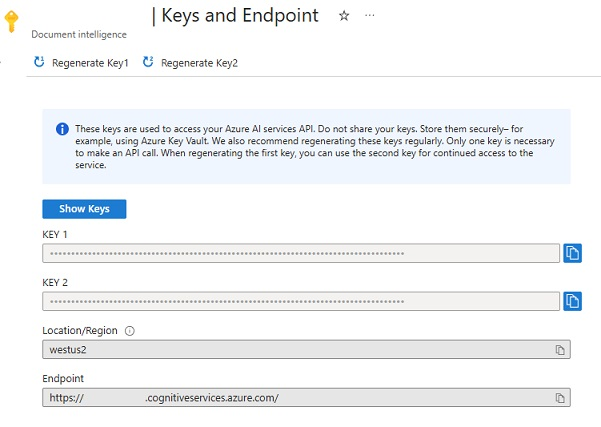
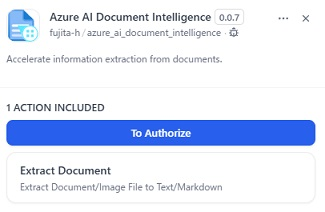
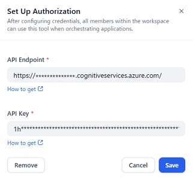
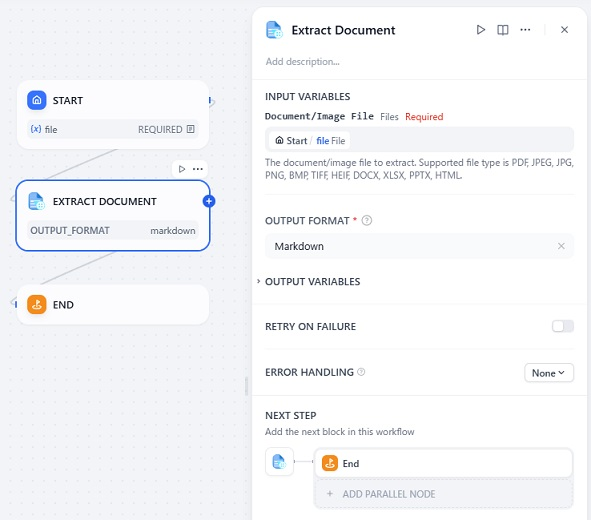

# Overview

This plugin provides tools to extract text from a document using the Azure AI Document Intelligence service.

## Important Notice

This plugin requires an Azure subscription. If you don't have an Azure subscription, create a free account before you begin. Learn more about the free trial [here](https://azure.microsoft.com/free/).

# Tools provided by this plugin

## Extract Document

This tool extracts text from a document using the Azure AI Document Intelligence service. The tool takes a document as input and returns the **Extracted Text** or **Markdown**.
Supported document formats include PDF, JPEG, JPG, PNG, BMP, TIFF, HEIF, DOCX, XLSX, PPTX, and HTML.  

Learn more about the Document Layout Analysis API v4.0 [here](https://learn.microsoft.com/azure/ai-services/document-intelligence/prebuilt/layout?view=doc-intel-4.0.0).

# Configuration

## 1. Create a resource in the Azure portal

Create an Azure AI Document Intelligence resource in the Azure portal.

## 2. Get the endpoint and key from the Azure portal

After creating the resource, get the **API Endpoint** and **API Key** from the Azure portal.

## 3. Install the plugin

Install the plugin by clicking on the **Install** button.

## 4. Authorize the plugin

Open the plugin, and click on the **To Authorize** button.

Input the **API Endpoint** and **API Key** you obtained from the Azure portal, and click on the **Save** button.

## 5. Use the tools provided by the plugin

Add tool to the canvas and configure it.

# Notes

This plugin uses the Document Layout Analysis API v4.0 of the [Azure AI Document Intelligence](https://azure.microsoft.com/products/ai-services/ai-document-intelligence) service. Please refer to the official documentation for more information.

# Report Issues and Contributing

Please report any issues to the [GitHub repository](https://github.com/fujita-h/dify-plugin-azure-ai-document-intelligence).  
This plugin is open-source and contributions are welcome.
